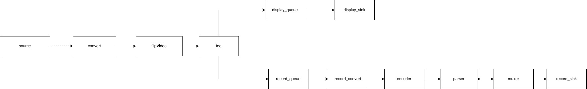

# GStreamer C++ Video Pipeline

A small C++ project built to learn the core concepts of GStreamer (elements, pads, dynamic pad linking, request pads, and pipeline branching with tee). 
Currently, it reads a video file, rotates it and displays it while simultaneously recording the output to a file.

See [Future work](#future-work) to learn about further development.

The footage was recorded at sea aboard a Navy ship.

## Pipeline



The pipeline is built in code, wrapping GStreamer's C API in a `Pipeline` class. 
The source uses dynamic pads, so it is linked at runtime through the `pad-added` signal.

## Dependencies

Requires GStreamer and CMake.

**macOS**
```bash
brew install gstreamer
```

**Linux (Debian/Ubuntu)**
```bash
sudo apt install libgstreamer1.0-dev gstreamer1.0-plugins-base gstreamer1.0-plugins-good
```

## Build

```bash
cmake -B build
cmake --build build
```

## Run

```bash
./build/pipelineApp
```

## Future work

- Add an `appsink`/`appsrc` branch to process frames in C++ (OpenCV)
- Integrate OpenCV to detect and track the dolphins in the footage
- Start/stop recording on demand (runtime), without interrupting the video display
- Add a timestamp overlay to the video
- Add video player GUI

## References

Based on the official GStreamer tutorials, adapted from C to C++ and restructured into a class.
